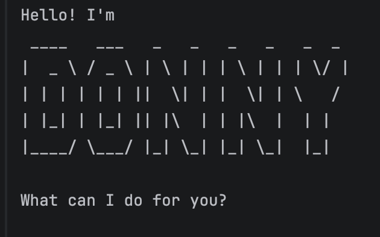

# Donny User Guide



Donny is a **command-line chatbot** that helps you manage your tasks efficiently.

It allows you to:

- keep track of tasks
- manage deadlines and events
- mark tasks as completed
- search tasks using keywords

Donny is designed for users who prefer **typing commands instead of using graphical interfaces**.

---

# Features

## Listing all tasks

Displays all tasks currently stored in Donny.

Example:

`list`

Expected output:

```
Here are the tasks in your list:
1. [T][ ] read book
2. [D][ ] return book (by: Sunday)
```

---

## Adding todos

Adds a simple task without a deadline.

Example:

`todo read book`

Expected output:

```
Got it. I've added this task:
[T][ ] read book
Now you have 1 tasks in the list.
```

---

## Adding deadlines

Adds a task that must be completed before a specific time.

Example:

`deadline return book /by Sunday`

Expected output:
```
Got it. I've added this task:
[D][ ] return book (by: Sunday)
Now you have 2 tasks in the list.
```

---

## Adding events

Adds a task that occurs during a time period.

Example:

`event project meeting /from Mon 2pm /to Mon 4pm`

Expected output:
```
Got it. I've added this task:
[E][ ] project meeting (from: Mon 2pm to: Mon 4pm)
Now you have 3 tasks in the list.
```

---

## Marking tasks as done

Marks a task as completed.

Example:

`mark 1`

Expected output:
```
Nice! I've marked this task as done:
[T][X] read book
```

---

## Unmarking tasks

Marks a completed task as not done.

Example:

`unmark 1`

Expected output:
```
OK, I've marked this task as not done yet:
[T][ ] read book
```

---

## Deleting tasks

Removes a task from the task list.

Example:

`delete 2`

Expected output:
```
Noted. I've removed this task:
[D][ ] return book (by: Sunday)
Now you have 1 tasks in the list.
```

---

## Finding tasks

Searches for tasks that contain a keyword in their description.

Example:

`find book`

Expected output:
```
Here are the matching tasks in your list:
[T][X] read book
[D][X] return book (by: Sunday)
```

---

## Exiting Donny

Closes the chatbot.

Example:

`bye`

Expected output:
```
See you again, bye!
```

---

# Command Summary

| Command | Description |
|------|------|
| `list` | Show all tasks |
| `todo DESCRIPTION` | Add a todo task |
| `deadline DESCRIPTION /by DATE` | Add a deadline |
| `event DESCRIPTION /from START /to END` | Add an event |
| `mark NUMBER` | Mark task as done |
| `unmark NUMBER` | Mark task as not done |
| `delete NUMBER` | Delete a task |
| `find KEYWORD` | Search tasks |
| `bye` | Exit Donny |

---

# Saving Data

All tasks are automatically saved to a file.

When Donny is restarted, your previous tasks will be loaded automatically.

---